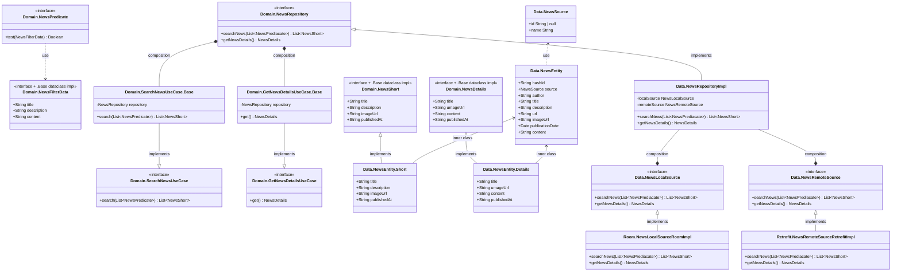

# Class diagram
 

# TODO
1. > use UML
1. > complete 

```mermaid
classDiagram
	subgraph DOMAIN
		%% model
			class `Domain.NewsFilterData` {
				<<interface + .Base dataclass impl>>
				+String title
				+String description
				+String content
			}

			class `Domain.NewsPredicate` {
				<<interface>>
				+test(NewsFilterData) Boolean
			}

			class `Domain.NewsShort` {
				<<interface  + .Base dataclass impl>>
				+String title
				+String description
				+String imageUrl
				+String publishedAt
			}

			class `Domain.NewsDetails` {
				<<interface + .Base dataclass impl>>
				+String title
				+String umageUrl
				+String content
				+String publishedAt
			}

			`Domain.NewsPredicate` ..> `Domain.NewsFilterData` : use

		%% use_case
			class `Domain.SearchNewsUseCase` {
				<<interface>>
				+search(List~NewsPredicate~) List~NewsShort~
			}

			class `Domain.SearchNewsUseCase.Base` {
				-NewsRepository repository
				+search(List~NewsPredicate~) List~NewsShort~
			}

			class `Domain.GetNewsDetailsUseCase` {
				<<interface>>
				+get() NewsDetails
			}

			class `Domain.GetNewsDetailsUseCase.Base` {
				-NewsRepository repository
				+get() NewsDetails
			}

			`Domain.SearchNewsUseCase.Base` --|> `Domain.SearchNewsUseCase` : implements
			`Domain.GetNewsDetailsUseCase.Base` --|> `Domain.GetNewsDetailsUseCase` : implements

			`Domain.NewsRepository` *-- `Domain.SearchNewsUseCase.Base` : composition
			`Domain.NewsRepository` *-- `Domain.GetNewsDetailsUseCase.Base` : composition

		%% repository
			class `Domain.NewsRepository` {
				<<interface>>
				+searchNews(List~NewsPrediacate~) List~NewsShort~
				+getNewsDetails() NewsDetails
			}
	end

	subgraph DATA
		%% news
			%% entity
				class `Data.NewsSource` {
					+id String | null
					+name String
				}

				class `Data.NewsEntity` {
					+String hashId
					+NewsSource source
				    +String author
				    +String title
				    +String description
				    +String url
				    +String imageUrl
				    +Date publicationDate
				    +String content
				}

				class `Data.NewsEntity.Short` {
					+String title
					+String description
					+String imageUrl
					+String publishedAt
				}

				class `Data.NewsEntity.Details` {
					+String title
					+String umageUrl
					+String content
					+String publishedAt
				}

				`Data.NewsSource` <.. `Data.NewsEntity` : use
				`Domain.NewsShort` <|-- `Data.NewsEntity.Short` : implements
				`Domain.NewsDetails` <|-- `Data.NewsEntity.Details` : implements
				`Data.NewsEntity` <-- `Data.NewsEntity.Short` : inner class
				`Data.NewsEntity` <-- `Data.NewsEntity.Details` : inner class

			class `Data.NewsRepositoryImpl` {
				-localSource NewsLocalSource
				-remoteSource NewsRemoteSource
				+searchNews(List~NewsPrediacate~) List~NewsShort~
				+getNewsDetails() NewsDetails
			}

			class `Data.NewsLocalSource` {
				<<interface>>
				+searchNews(List~NewsPrediacate~) List~NewsShort~
				+getNewsDetails() NewsDetails
			}

			class `Data.NewsRemoteSource` {
				<<interface>>
				+searchNews(List~NewsPrediacate~) List~NewsShort~
				+getNewsDetails() NewsDetails
			}

			`Data.NewsRepositoryImpl` --* `Data.NewsLocalSource` : composition
			`Data.NewsRepositoryImpl` --* `Data.NewsRemoteSource` : composition
			`Domain.NewsRepository` <|-- `Data.NewsRepositoryImpl` : implements

		%% retrofit
			class `Retrofit.NewsRemoteSourceRetrofitImpl` {
				+searchNews(List~NewsPrediacate~) List~NewsShort~
				+getNewsDetails() NewsDetails
			}

			`Data.NewsRemoteSource` <|-- `Retrofit.NewsRemoteSourceRetrofitImpl` : implements

		%% room
			class `Room.NewsLocalSourceRoomImpl` {
				+searchNews(List~NewsPrediacate~) List~NewsShort~
				+getNewsDetails() NewsDetails
			}

			`Data.NewsLocalSource` <|-- `Room.NewsLocalSourceRoomImpl` : implements
	end
```
