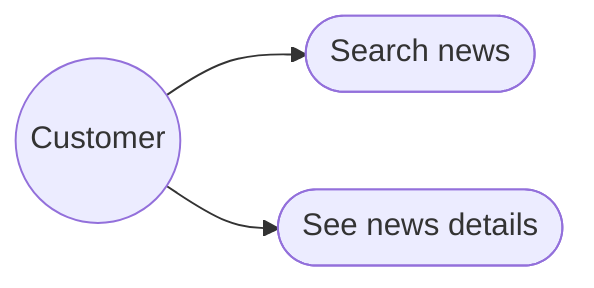
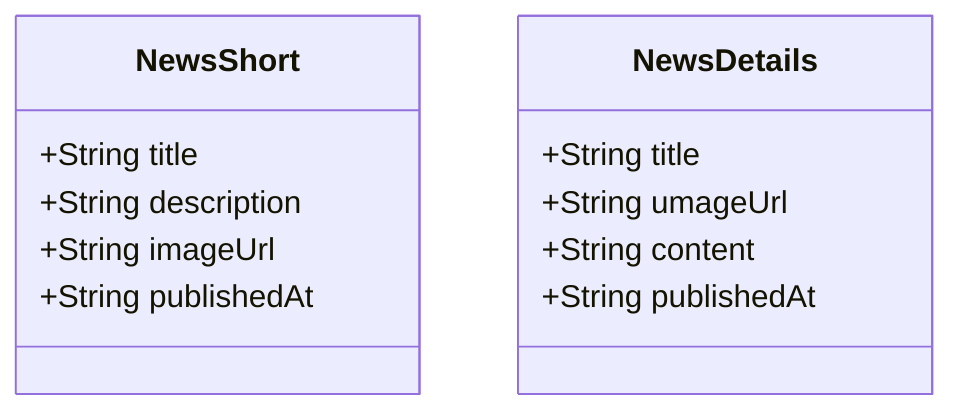

```mermaid
flowchart LR
user((Customer))
searchNews([Search news])
getNewsDetails([See news details])
user --> searchNews
user --> getNewsDetails
```
---

```mermaid
classDiagram
class NewsShort{
	+String title
	+String description
	+String imageUrl
	+String publishedAt
}
class NewsDetails{
	+String title
	+String umageUrl
	+String content
	+String publishedAt
}
```